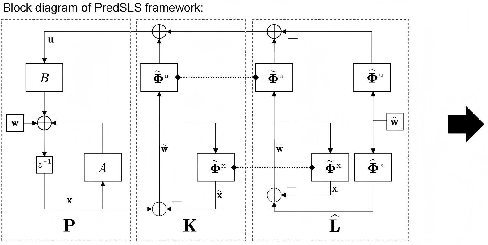
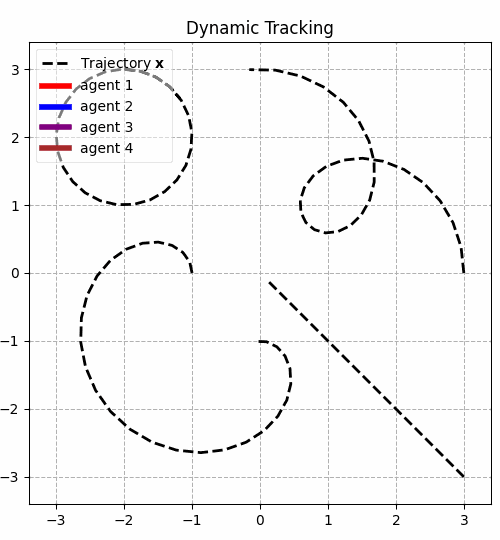

# Predictive-System-Level-Synthesis 
#### This is the code repository for paper: [Localized Control of Networked Systems via Predictive System-Level Synthesis](https://)
#### Authors: Yifei Wu [1], Jing Yu [2], Tongxin Li [1]

[1] Chinese University of Hong Kong, Shenzhen

[2] University of Washington
## Introduction
Distributed control of large-scale systems is challenging due to the need for scalable and localized communication and computation. In this work, we introduce a **Pred**ictive **S**ystem-**L**evel **S**ynthesis (**PredSLS**) framework that designs closed-loop controllers by jointly integrating communication constraints and perturbation predictions into an affine feedback structure. Rather than focusing on worst-case uncertainty, **PredSLS** leverages both current state feedback and future system disturbance predictions to achieve distributed control of networked systems.
The **PredSLS** framework can be naturally decomposed into spatial and temporal components for efficient and parallelizable computation across the network, yielding a regret upper bound that explicitly depends on the prediction error and communicative distance. Our regret-optimal analysis not only reveals a
non-monotonic trade-off between control performance and communicative distance when prediction errors are present, but also  guides the identification of an optimal communicative distance, thereby enabling the co-design of controller and its underlying communication topology.

<div align=center>

</div>

## Configuration
This code requires the following:
<!--
We recommend using Python 3 (and pip3) or above. 
-->
* python 3+
* cvxpy 1.4+
* numpy 1.26+
* control 0.9+

## Get Started
Run and plot the control trajectories of **PredSLS** by:
```
python main.py
```

## Questions?

Please email me <yifeiwu1@link.cuhk.edu.cn>, Tongxin Li <litongxin@cuhk.edu.cn>, or Jing Yu <jingyua@umich.edu> if you have any code or implementation questions.
